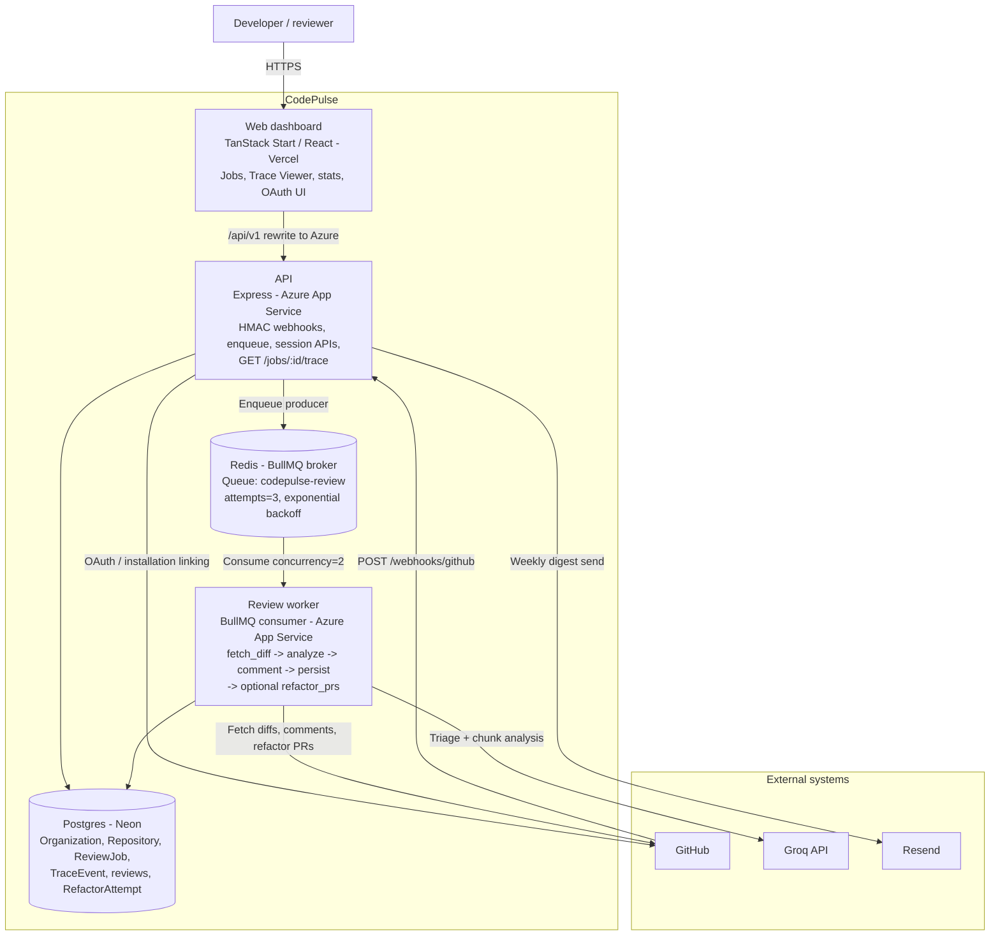
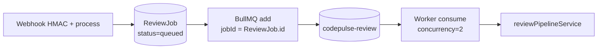

# C4 Level 2 - Containers

**Status:** Finalized  
**Scope:** Deployable/runtime containers. Matches ADR 001 (API enqueue-only + separate BullMQ worker), ADR 002 (`ReviewJob` uniqueness in Postgres). Trace Viewer is a **web** feature calling the API.  
**Note:** Standard Mermaid `flowchart` (GitHub-native), not `C4Container`. Verified with `mmdc`.

## Queue relationship (explicit)

## Notes

- **Trace Viewer** is in the **web** container; data from `GET /jobs` and `GET /jobs/:id/trace` (alias `/traces`).
- **Local Redis:** host port **6380**; production via `REDIS_URL`.
- **Two App Services:** `thecodepulse` (API) and `thecodepulse-worker` (`npm run worker`) - ADR 001.
- **Resend** is used by the API for scheduled digests (not on the webhook->review hot path).
- **Dead jobs:** no separate DLQ container - terminal state is Postgres `ReviewJob.status=dead` on the same BullMQ queue (see sequence doc).
