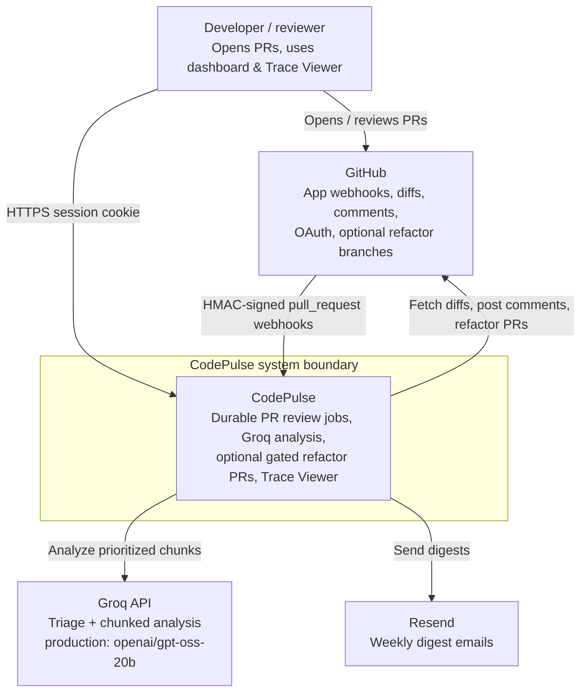

# C4 Level 1 - System context

**Status:** Finalized  
**Scope:** CodePulse as one system and its external actors. Matches ADR 003 (tenant = GitHub installation) and ADR 005 (Groq for analysis).  
**Note:** Drawn as a standard Mermaid `flowchart` (GitHub-native). Semantic C4 L1 layout; avoids `C4Context` which does not render on GitHub.

## Notes

- **Boundary:** Web (Vercel), API + worker (Azure), Neon, and Redis are one product at L1; see [container-diagram.md](./container-diagram.md).
- **Tenant model:** GitHub App installation -> `Organization`; dashboard and `/jobs/:id/trace` are installation-scoped (ADR 003).
- **Resend** is a real external dependency for weekly digests (same footing as other outbound mail providers in sibling projects).
