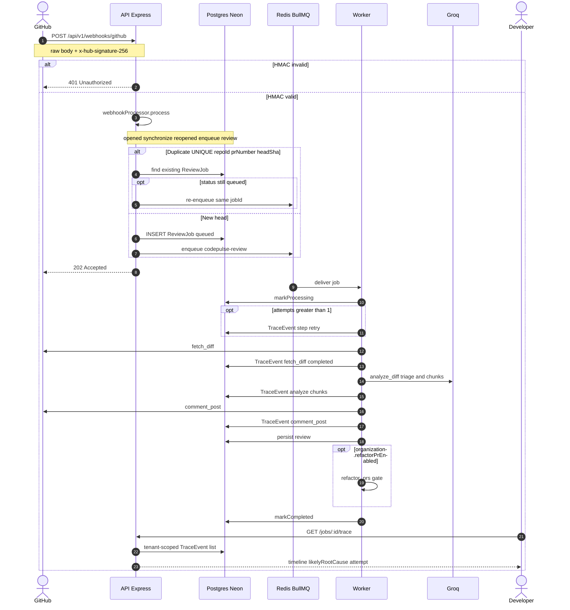
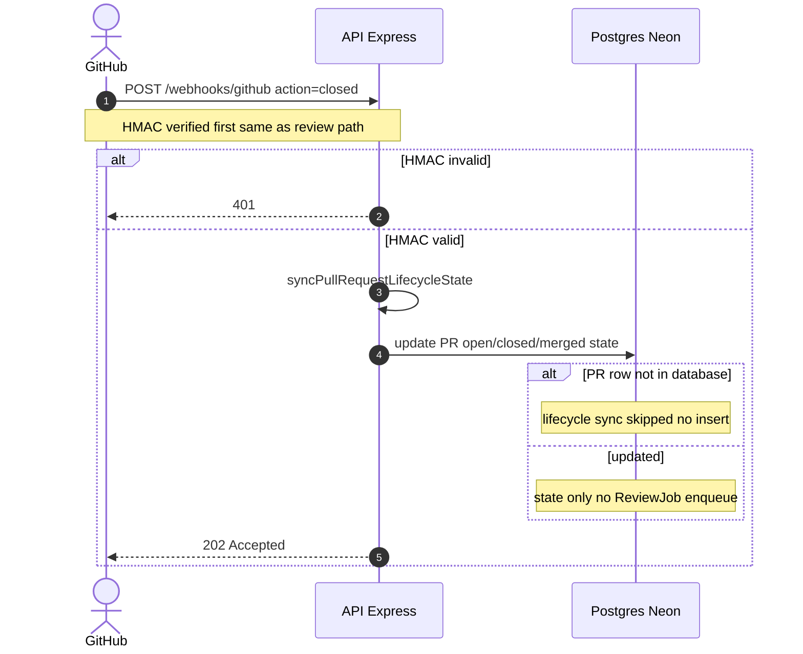
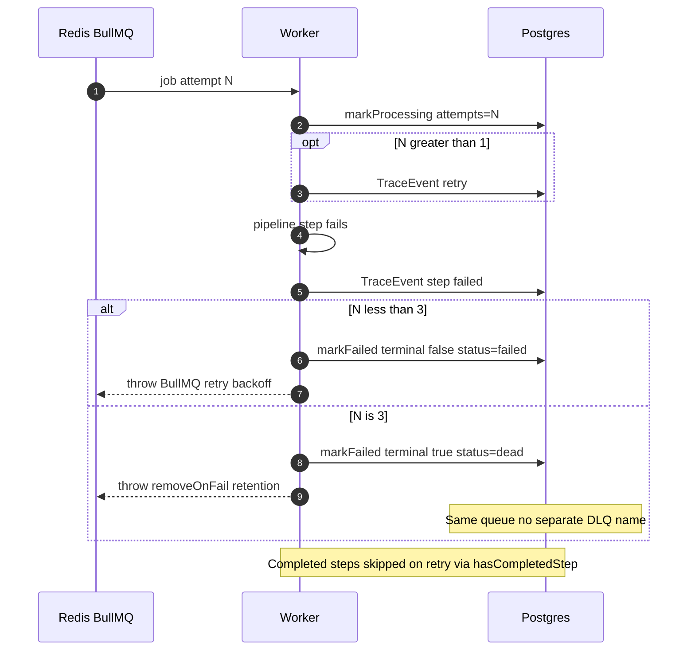
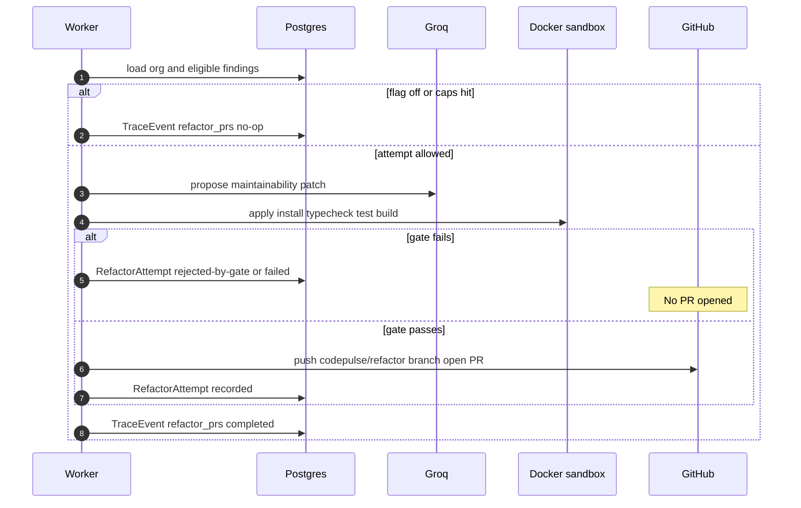

# Sequence - webhook to review (current pipeline)

**Status:** Finalized  
**Scope:** Shipped path after BullMQ + TraceEvent + Phase 4 refactor gate. Source of truth: `webhooks.ts`, `webhookProcessor`, `queue.ts`, `worker.ts`, `reviewPipelineService.ts`, ADR 001-004.

Constants: queue `codepulse-review`, `REVIEW_JOB_MAX_ATTEMPTS = 3`, backoff 5s exponential, worker concurrency 2. Org flag `refactorPrEnabled` defaults **OFF**.

## Happy path - review enqueue + ACK

## Closed / merged - lifecycle only (no review)

`pull_request` + `action=closed` updates stored PR lifecycle state and **never** enqueues AI review (`webhookProcessor`: “Closed/merged events update lifecycle state only”).

## Retry / failure / dead (intentional - no separate DLQ queue)

**Design choice (not a cut corner):** Product “dead letter” is Postgres `ReviewJob.status = dead` after the 3rd failed attempt. There is **no** separate BullMQ DLQ queue name. BullMQ retries on the same queue `codepulse-review` (`attempts: 3`, `removeOnFail: 200` retains failed Redis job records for ops). Terminal failure is visible on `/jobs` + Trace Viewer via the `dead` row.

## Phase 4 - refactor-PR verification gate (opt-in)

Runs only as pipeline step `refactor_prs` **after** `persist`, when `Organization.refactorPrEnabled` is true. Eligible findings: `code-quality`, `best-practices`. Caps enforced **before** Groq and **before** sandbox (ADR 004).

## Cross-checks

| Claim in diagrams | Code / ADR |
|---|---|
| HMAC fail -> 401; success path -> 202 after process | `verifyGitHubSignature`, `webhooks.ts` |
| `closed` -> lifecycle only, no enqueue | `webhookProcessor` comment + early return |
| API does not run Groq synchronously | ADR 001 |
| Idempotency `UNIQUE(repoId, prNumber, headSha)` | ADR 002 |
| Terminal failure = `ReviewJob.status=dead`, same queue | `markFailed(terminal)`, `REVIEW_JOB_MAX_ATTEMPTS` - intentional |
| Refactor only after sandbox; flag default OFF | ADR 004 |
| Trace Viewer tenant-scoped | ADR 003, `GET /jobs/:id/trace` |
